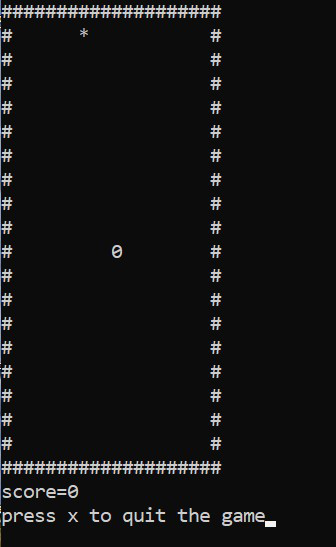

# LTTS End Module Project on Multiplatform Programming Using C

## Snake Game Implementation 
This project is implemented using C langauge. User is displayed with a snake and a bounded area in which the snake can run. The snake is feeded with a food. The food is the target is the target for the snake and it runs behind the behind the food. User is supposed to provide the directional input to snake so that it finds the food and does not collide with the boundary.

___

# Badges

## To Build and Execute
~~~
 make all
 make run
~~~

## To Test
~~~
make test
~~~

## To Clean
~~~
make clean
~~~

## Input Format
1. The boundary is shown to the user 
1. The user is supposed to give instruction as follows-
    1. To move the snake upwards: W
    1. To move the snake downwards: S
    1. To move the snake left:D
    1. To move the snake right:A
1. User has to take care that the snake should not collide with the boundary otherwise the game would be over.
___
## Output Format 

___

## Learning Resources
1. Geeksforgeeks
1. Futureskills Resources provided by Prithvi and Bharath 
1. [MARKDOWN](https://github.com/adam-p/markdown-here/wiki/Markdown-Cheatsheet)

## Challenges Faced 
1. Implementing a game c language is very tough.
Difficulities in creating area for snake to roam
2. Use of windows and ranf()
